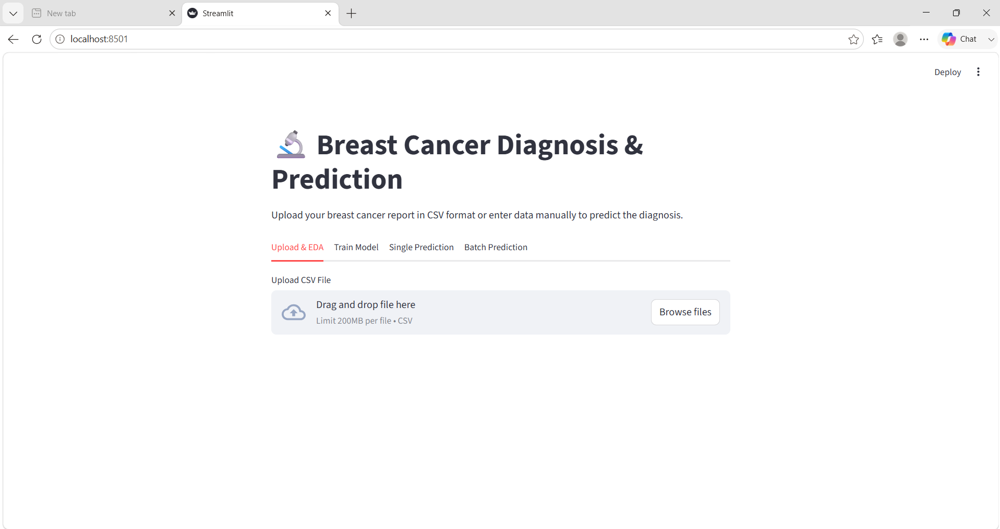
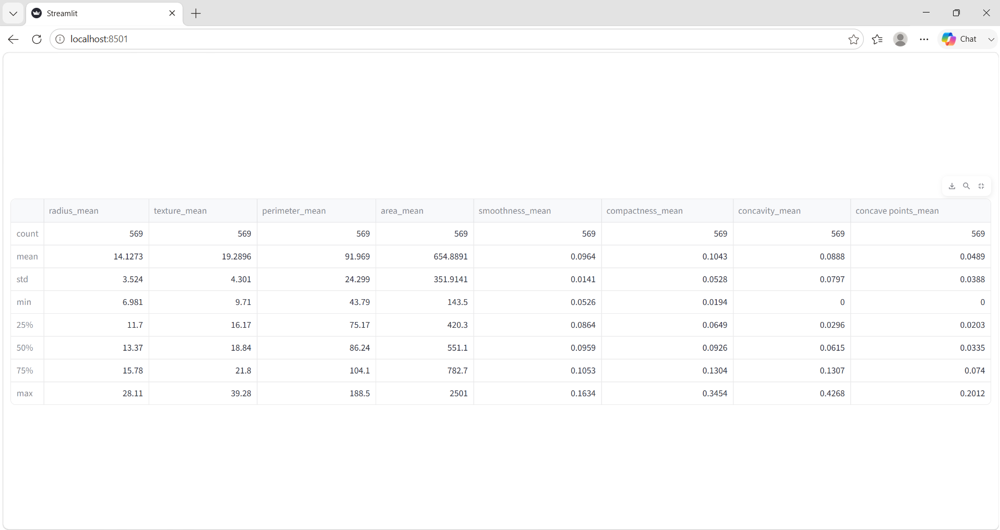
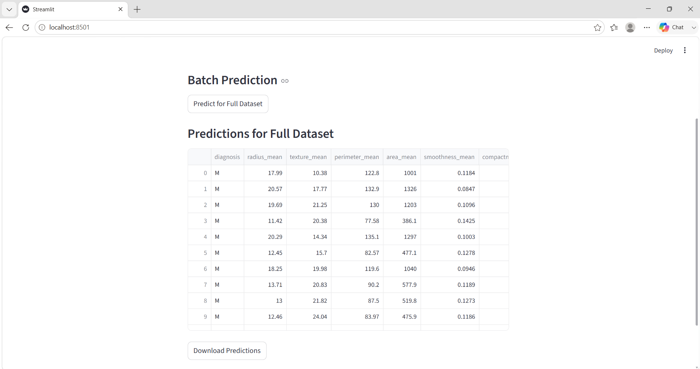

# Breast Cancer Prediction

## Overview

Breast Cancer Prediction is a Machine Learning web application developed using Python and Streamlit. The application allows users to upload breast cancer datasets, perform Exploratory Data Analysis (EDA), train multiple machine learning models, and predict whether a tumor is Benign or Malignant.

## Features

- Upload breast cancer dataset in CSV format
- Perform Exploratory Data Analysis (EDA)
- Correlation Heatmap Visualization
- Pair Plot Analysis
- Distribution Analysis
- Train Multiple Machine Learning Models
- Single Patient Prediction
- Batch Prediction for Entire Dataset
- Download Prediction Results as CSV

## Technologies Used

### Programming Language
- Python

### Machine Learning
- Scikit-learn
- XGBoost

### Data Analysis
- Pandas
- NumPy

### Data Visualization
- Matplotlib
- Seaborn

### Web Framework
- Streamlit

## Machine Learning Models Used

- Support Vector Machine (SVM)
- Random Forest Classifier
- Logistic Regression
- K-Nearest Neighbors (KNN)
- XGBoost Classifier
- Decision Tree Classifier

## Project Structure

```text
Breast-Cancer-Prediction/
│
├── app.py
├── requirements.txt
├── README.md
├── batch_predictions.csv
│
└── screenshots/
    ├── home.png
    ├── eda.png
    └── prediction.png
```

## Installation

Clone the repository:

```bash
git clone https://github.com/lakshmansundarm/breast-cancer-prediction.git
```

Navigate to project folder:

```bash
cd breast-cancer-prediction
```

Install dependencies:

```bash
pip install -r requirements.txt
```

Run the application:

```bash
streamlit run app.py
```

## Screenshots

### Home Page



### Exploratory Data Analysis (EDA)



### Prediction Result



## Learning Outcomes

- Machine Learning Classification
- Data Preprocessing
- Exploratory Data Analysis
- Model Evaluation
- Streamlit Web Application Development
- Data Visualization
- Python Programming

## Future Enhancements

- Deploy application on Streamlit Cloud
- Improve model accuracy
- Add Confusion Matrix Visualization
- Add ROC Curve Analysis
- Support additional datasets

## Author

**Lakshman Sundar**

- GitHub: https://github.com/lakshmansundarm
- Email: lakshmansundarm@gmail.com

---
⭐ If you found this project useful, please consider giving it a star.
